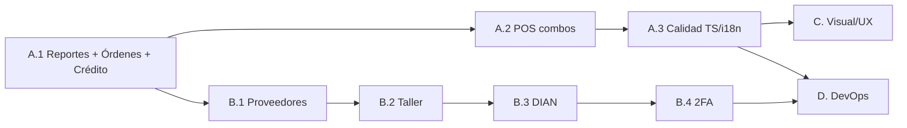

# Plan MotoStock — Cerrar backend e impulsar frontend

Última actualización: mayo 2026

## Estado actual

| Módulo | Backend API | Frontend conectado |
|--------|-------------|-------------------|
| Auth / JWT | ✅ | ✅ Login, rutas protegidas |
| Inventario | ✅ | ✅ React Query |
| Ventas (POS) | ✅ | ✅ React Query (combos aún demo) |
| Clientes | ✅ | ✅ React Query |
| Dashboard | ✅ (reports + sales) | ✅ React Query |
| Reportes | ✅ `/reports/sales`, `/inventory` | 🔄 En progreso |
| Órdenes de compra | ✅ `/orders` | 🔄 En progreso |
| Crédito tienda | ✅ `/clients/{id}/ledger` | 🔄 En progreso |
| Backups | ✅ | ✅ AdminBackups |
| Config DIAN | ✅ `/invoices/company-config` | ✅ AdminDianConfig (UI) |
| Proveedores | ❌ Sin API | ❌ Solo Zustand |
| Taller (OT, vehículos) | ❌ Sin API | ❌ Solo Zustand |
| 2FA / Refresh tokens | ⚠️ Código existe, routers no registrados | ❌ Deshabilitado |
| Combos venta | ✅ API `/sales/combos` | ❌ POS usa demo |

---

## Fase A — Cerrar integración frontend ↔ API (1–2 semanas)

Objetivo: ninguna pantalla de negocio crítica dependa de `store` demo.

### A.1 Operación diaria (prioridad alta) — *esta sesión*

- [x] Login + migraciones + seed
- [x] Inventario, Ventas, Clientes, Dashboard
- [x] **Reportes** → `useSalesReport`, `useInventoryReport`
- [x] **Órdenes de compra** → `useOrders`, `useCreateOrder`, `useUpdateOrderStatus`
- [x] **Crédito tienda** → `useAdjustClientCredit`, ventas crédito desde API
- [ ] **Etiquetas inventario** → `useProducts` + `api.updateProduct` (quitar `store.products`)

### A.2 POS y flujos restantes

- [ ] Combos en ventas (listar/crear vía API o ocultar hasta tener datos seed)
- [ ] Inventario: quitar `store.addPurchaseOrder` del flujo “pedido rápido” → API orders
- [ ] Profile: solo datos de `/auth/users/me` (ya parcial)

### A.3 Calidad frontend

- [ ] Unificar imports `Button.tsx` / `button.tsx` (destraba `typecheck` en Windows)
- [ ] i18n: español en pantallas aún en inglés (Clients, Reports, PurchaseOrders)
- [ ] Estados vacíos / loading / error consistentes (patrón Inventory)
- [ ] Responsive y modo tablet en Ventas (ya existe, validar con API)

---

## Fase B — Completar backend faltante (2–3 semanas)

Objetivo: API REST para todo lo que hoy es demo en Zustand.

### B.1 Proveedores ✅

```
GET/POST/PUT /api/suppliers
```

- [x] Modelo `suppliers` + migración `20260521_01`
- [x] `purchase_orders.supplier_id` (FK opcional)
- [x] Frontend `Suppliers.tsx` + dropdown en `PurchaseOrders.tsx`

### B.2 Taller ✅

```
GET/POST/PUT /api/vehicles
GET/POST/PATCH /api/work-orders
GET /api/service-templates
```

- [x] Tablas taller + seed `service_templates`
- [x] Estados OT: scheduled → in_progress → completed / cancelled
- [x] Frontend `Workshop.tsx` 100% API

### B.3 Facturación DIAN (producción) — ⏸ PAUSADO

> Pausado hasta normalizar situación de la empresa. Preview local sigue disponible.

- [ ] Registrar emisión real con proveedor (Siigo/mock)
- [ ] PDF/QR producción
- [ ] Tests de integración con mock HTTP

### B.4 Auth avanzado ✅

- [x] Migración `refresh_tokens` + columnas 2FA en `users`
- [x] Endpoints `/api/auth/token-with-refresh`, `/refresh`, `/logout`
- [x] Rutas `/api/2fa/*` (TOTP sobre modelo `User`)
- [x] UI 2FA en `Profile.tsx`
- [ ] Tests unitarios legacy `test_refresh_tokens.py` (siguen en `collect_ignore`)

### B.5 Tests backend ✅

- [x] Smoke `test_health.py`
- [x] `test_api_phase_b.py` (auth, refresh, suppliers, workshop, 2FA)
- [x] `test_api_core.py` (inventory CRUD, venta + stock, ledger clientes)
- Meta CI: 11 tests verdes (`pytest tests/`)

---

## Fase C — Frontend visual y UX ✅

Objetivo: producto usable en taller real, no solo funcional.

### C.1 Design system ✅

- [x] Tokens CSS (`tokens.css`) + tipografía `--font-sans`
- [x] Componentes: `KpiCard`, `PageSkeleton`, `NumericKeypad`
- [x] Un solo `Button` / `Input` (sin duplicado `button.tsx`)

### C.2 Pantallas clave ✅

| Pantalla | Estado |
|----------|--------|
| Login | ✅ Branding split, errores claros, i18n |
| Dashboard | ✅ KPI + tendencia vs ayer, skeleton |
| Ventas (POS) | ✅ Teclado numérico efectivo, feedback escaneo, sonido venta |
| Inventario | ✅ Filtros categoría/marca, selección masiva |
| Clientes | ✅ Tarjetas aceite destacadas |
| Reportes | ✅ Gráfico recharts + export PDF/Excel |

### C.3 Experiencia operativa ✅

- [x] `OfflineStatusBar` global (cola sync visible)
- [x] Toast + sonido al completar venta
- [x] `print.css` para tickets/etiquetas
- [x] Labels y foco en escáner POS

### C.4 Internacionalización ✅

- [x] Claves i18n ampliadas (login, clientes, reportes, nav)
- [x] Idioma por defecto `es`
- [x] `formatCurrency` / `formatDate` en COP (`es-CO`)

---

## Fase D — DevOps y entrega (1 semana)

- [x] CI: typecheck + build frontend, alembic + pytest backend
- [ ] CD staging (Docker Compose o Railway/Fly)
- [ ] Variables entorno documentadas (`.env.example`)
- [ ] Healthchecks y backups automáticos verificados
- [ ] README operativo: primer arranque, usuarios demo, puertos 8080/8000

---

## Orden de ejecución recomendado



---

## Credenciales demo

| Usuario | Contraseña | Rol |
|---------|------------|-----|
| admin | admin123 | admin |
| cashier | cashier123 | cashier |

URLs: Frontend http://localhost:8080 — API http://localhost:8000/docs

---

## Definición de “backend terminado”

1. Todas las entidades del negocio tienen modelo + migración + rutas CRUD.
2. pytest cubre flujos venta, stock, crédito, órdenes.
3. Sin `alembic stamp` hacks; solo `upgrade head`.
4. Routers opcionales (2FA) registrados o documentados como feature flag.

## Definición de “frontend listo para taller”

1. Cero datos demo en rutas `/sales`, `/inventory`, `/clients`, `/dashboard`, `/reports`.
2. `typecheck` y `build` verdes en CI.
3. Flujo venta → stock → reporte verificado manualmente en Docker.
4. UI en español, legible en tablet 10".
